# DevAssist AI 架构说明

## 1. 文档目的

DevAssist AI 是一个面向 Python、PyTorch、Transformers 与 FastAPI 常见问题的本地技术支持演示系统。它当前解决的不是“让大模型自由回答”，而是一个更窄、更容易验证的问题：在给定版本和项目范围内检索策划过的资料，只依据这些资料生成诊断步骤，并在证据不足时拒答。

当前仓库的默认路径完全离线：不下载模型、不调用外部 API、不执行用户代码，也不依赖向量数据库。配置 OpenAI-compatible endpoint 后可以启用结构化生成，但它是显式 opt-in，并在请求失败或响应不合法时回退到抽取式生成。离线约束仍是默认回归基线。

## 2. 当前系统边界

系统已经实现：

- UTF-8 JSONL 知识库的读取、清洗、去重和 Markdown 感知切块；
- 依赖标准 Python、NumPy 与 scikit-learn 的 BM25 + LSA 混合检索；
- 项目、来源类型和近似版本兼容过滤；
- 基于 40 组标注 pair 训练 Logistic Regression，并与安全默认值混合的可解释重排；
- 有限状态的 `analyse -> retrieve -> gate -> generate -> validate` 工作流；
- 抽取式诊断与引用回查；
- FastAPI 接口、线程内反馈写入、内存指标与本地限流；
- 四种检索模式的离线消融和拒答评测。
- 可选 OpenAI-compatible 结构化生成与抽取式故障回退；
- Python 3.12 slim、非 root 用户和健康检查组成的 Docker/Compose 本地部署。

系统尚未实现：

- Sentence Transformer、Cross-Encoder 或任何神经模型适配器；
- 在线抓取、自动同步官方文档或 Issue；
- Qdrant、Redis、Elasticsearch 等外部基础设施；
- 多进程共享限流、指标或反馈锁；
- 生产规模语料、人工双标数据集与独立盲测集。
- LLM 输出的 claim-level 事实支持验证，以及外部模型质量/隐私评测。

`pyproject.toml` 中的 `sentence-transformers` 是可选依赖声明，不代表当前已有对应实现。OpenAI-compatible 生成器使用 Python 标准库 HTTP 客户端，与该可选依赖无关。

## 3. 运行时全景

```mermaid
flowchart LR
    U[CLI / Web / API Client] --> P[Pydantic Request Validation]
    P --> S[DevAssistService]
    S --> A[QueryAnalyzer + Security Inspection]
    A --> R[HybridRetriever]
    R --> B[BM25]
    R --> D[TF-IDF + LSA]
    B --> F[RRF + Normalized Scores]
    D --> F
    F --> X[FeatureReranker + Version Filter]
    X --> G[Evidence / Confidence Gates]
    G -->|sufficient, default| E[ExtractiveGenerator]
    G -->|sufficient, opt-in| L[OpenAI-compatible JSON Generator]
    L -->|runtime / schema failure| E
    G -->|insufficient| Z[Structured Refusal]
    E --> C[Citation Build + Validation]
    C --> O[DiagnoseResponse]
    K[(UTF-8 JSONL Knowledge Base)] --> T[KnowledgeStore]
    T --> R
    I[Offline Ingestion CLI] --> K
    Q[40 labelled pairs] --> W[LogisticRegression + safe blend]
    W --> J[(reranker weights artifact)]
    J --> X
```



## 4. 模块职责

| 模块 | 当前职责 | 关键边界 |
|---|---|---|
| `config.py` | 从环境变量构造不可变配置；解析仓库相对路径 | 不加载 `.env`，不持有密钥客户端 |
| `domain.py` | 不可变知识文档、检索结果、查询分析对象 | 内部对象，不直接作为 HTTP Schema |
| `models.py` | Pydantic 请求与响应契约 | 禁止额外输入字段；限制问题长度和 `top_k` |
| `ingestion/` | JSONL 读取、规范化、稳定 ID、去重、代码块安全切分、原子写入 | 离线预处理，不在每次服务启动时自动重写语料 |
| `store.py` | 线程安全加载 JSONL，并按 ID 建立内存视图 | 全量内存加载；不支持增量索引 |
| `retrieval/` | 分词、BM25、LSA、融合、版本评分与加载权重的特征重排 | O(N) 本地检索，适合小型演示集 |
| `training/` | 从正/难负 pair 构造六维特征，训练 Logistic Regression 并安全混合权重 | 当前训练集只有 40 pair，没有 held-out 训练评测 |
| `security.py` | 检测常见提示注入文本并对疑似密钥脱敏 | 规则式检测，不是完整内容安全产品 |
| `analyzer.py` | 识别项目、版本、意图、异常名和缺失环境信息 | 项目词典当前只覆盖 3 个技术域 |
| `agent.py` | 固定步骤编排、证据门控、拒答与置信度计算 | 无自由规划、无任意工具调用 |
| `generation.py` | 默认抽取；可选调用 OpenAI-compatible JSON 接口并在失败时抽取回退 | LLM 的 diagnosis/steps 尚无 claim-level 蕴含校验 |
| `citations.py` | 从实际检索结果创建引用并做元数据、证据子串校验 | 只验证来源一致性，不等于逐 claim 蕴含判断 |
| `service.py` | 索引生命周期、查询、诊断、反馈和运行指标 | 进程内状态；反馈锁只覆盖当前进程 |
| `api/app.py` | FastAPI 生命周期、路由、线程池与本地限流 | 面向本地演示，非分布式网关 |
| `evaluation/` | 离线检索消融、拒答和引用合法性评测 | 当前只评测提交的 smoke 数据 |
| `Dockerfile` / Compose | 安装核心依赖、复制样例/权重、以非 root 用户运行 API | 镜像不包含训练集、测试或训练脚本；权重需预先生成 |

## 5. 数据摄取设计

离线数据链路为：

```text
JSONL -> UTF-8 解码 -> 字段规范化 -> 必填校验 -> 稳定 ID
      -> 语义指纹去重 -> Markdown 感知切块 -> UTF-8 原子写入
```

重要实现约束：

- loader 接受 UTF-8 与 UTF-8 BOM，忽略空行，并在 JSON 错误中返回行号；
- 写入使用目标目录中的临时文件，再通过 `Path.replace` 替换，兼容 Windows；
- 清洗统一 CRLF/CR 为 LF，但保留 fenced code block 内的缩进、Tab、空行和尾随空格；
- 未提供 ID 时，对规范化后的项目、版本、来源类型、标题、URL 和正文计算 SHA-256 派生 ID；
- 去重指纹包含项目、版本、来源类型、标题和正文，因此相同正文的不同版本不会被误合并；
- 同一个显式 ID 对应不同规范化正文会直接报错；
- `max_chars` 是软上限：超长代码块宁可单块超限，也不从中间切断；
- 多块文档的 chunk ID 同时包含父文档 ID、顺序号与内容摘要，重复构建结果稳定。

运行时服务默认直接加载 `data/sample/knowledge_base.jsonl`。摄取管线是显式 CLI 预处理步骤，不会在 API 启动时隐式修改提交的数据。

## 6. 默认离线检索

### 6.1 BM25

BM25 使用仓库内实现，默认 `k1=1.5`、`b=0.75`。分词器保留英文 API、异常名、点号路径和版本号，并为连续中文同时产生整段与二元字符 token。它擅长处理 `torch.cuda.is_available`、`UnpicklingError`、HTTP 422 等精确字符串。

### 6.2 LSA “Dense”

类名 `LSADenseIndex` 中的 dense 指低维稠密矩阵，不代表神经语义模型。默认算法是：

1. `char_wb` 字符 TF-IDF，字符 n-gram 范围为 2 至 5；
2. 组件数取 `min(128, 文档数 - 1, 特征数 - 1)`；
3. 组件数至少为 2 时运行 `TruncatedSVD(random_state=42)`；
4. 文档与查询向量归一化后计算相似度，并裁剪到 `[0, 1]`；
5. 极小语料无法做 SVD 时直接使用 TF-IDF 稀疏矩阵。

这是当前可复现默认方案：CPU 可运行、无需网络、CI 不会因模型缓存变化而漂移。代价是语义泛化、跨语言迁移和长距离关系明显弱于训练过的 embedding 模型。

### 6.3 融合与重排

候选先按 `project` 和 `source_type` 过滤。BM25 与 LSA 各取最多 `candidate_k` 条，默认值为 20。混合模式对两路排名计算 RRF，并同时保留归一化原始分数：

```text
rrf(doc) = Σ 1 / (60 + rank)
fused = 0.55 * normalized_rrf
      + 0.25 * normalized_bm25
      + 0.20 * normalized_lsa
```

`hybrid_rerank` 使用六个可解释特征进行逻辑函数重排：融合分、正文重合、标题重合、代码/异常 token、版本兼容度、来源权威度。仓库提交的 `artifacts/reranker/weights.json` 是当前默认权重，`Settings` 和 `DevAssistService` 会在启动、评测与 reindex 时加载它；文件缺失时 `FeatureReranker` 回退到代码内安全默认值。

权重训练流程读取 40 组 pair，其中 20 个正例、20 个策划型难负例。每个 pair 先经 hybrid 检索获得 fused 特征，再用 `LogisticRegression(class_weight="balanced", solver="liblinear", random_state=42)` 拟合。负系数被裁剪为零，正系数归一化后只占最终权重的 30%，其余 70% 保留安全默认值，最后再次归一化。当前 artifact 权重为：

```text
fused         0.37271558
body_overlap  0.24250501
title_overlap 0.12600426
code_signal   0.11177516
version       0.08400000
authority     0.06300000
```

artifact 记录的训练集 accuracy 为 1.000，但这是同一批 40 pair 上的 resubstitution accuracy，只能证明训练管线能拟合输入，不能作为 held-out 质量结论。pair 与 smoke benchmark 还共享主题和 21 条知识文档，过拟合/泄漏风险很高。它也不是 Cross-Encoder；未来仍可在不改变 `HybridRetriever.search` 调用方的情况下增加 embedding/Cross-Encoder 适配器，并保留离线 LSA 回退。

## 7. 版本感知语义

当前版本解析会把 Python、CUDA、Pydantic/Uvicorn 等依赖版本与目标框架版本分开，并规范化 `torch → pytorch`、`huggingface → transformers` 等结构化别名；底层数字比较仍只读取版本字符串开头的数字元组，不是完整 PEP 440 求解器。兼容评分规则大致为：

- 未请求版本：`1.0`；
- 文档标记为 `all/any/latest`：`0.96`；
- 相同 major/minor：`1.0`；
- 可比较但只共享 major：`0.68`；
- major 不同：`0.35`。

诊断链路会在生成前执行 fail-closed 检查：数字版本超出知识库已验证的 major/minor 范围、请求使用无法冻结的 `latest/any/all`，或最终结果中没有兼容证据，均返回 `VERSION_MISMATCH`。探索性的 `/v1/search` 仍可能在完全无兼容项时显示带 `version-fallback` 原因的相似项；它不应被当作诊断答案。

若扩展到生产，应使用 `packaging.version.Version` 与显式的版本范围字段，区分预发布、build tag、依赖约束和“最新版”语义。

## 8. 有限 Agent 与拒答链

当前 Agent 没有循环规划器。每个请求最多经历一次分析、一次检索、一次生成和一次引用验证，因而不存在无限工具调用或执行检索内容指令的问题。

拒答顺序如下：

1. 请求主要是提示注入且没有技术问题：`UNSAFE_QUERY`；
2. 请求版本超出已验证 major/minor 范围，或使用 `latest/any/all`：`VERSION_MISMATCH`；
3. 无候选：`NO_EVIDENCE`；
4. 查询含 OOM 等鲜明错误，但候选没有该主题证据：`NO_EVIDENCE`；
5. 无兼容证据：`VERSION_MISMATCH`；
6. 候选仅有表面相似词、缺少词法/代码锚点：`NO_EVIDENCE`；
7. 置信度低于默认 `0.36`：`LOW_CONFIDENCE`；
8. 无解决步骤或引用无法回查：`NO_EVIDENCE`；
9. 其余情况返回 `ANSWERED`。

置信度由重排分、BM25、LSA、正文重合、代码信号、版本和 authority 的固定权重组成，并上限裁剪到 `0.99`。LSA 只负责扩大候选，不能单独成为“事实已被证明”的条件；系统还要求词法或代码锚点。

默认生成器只取首条文档的 `summary` 作为诊断，并从前三条结果的 `resolution` 合并最多六个去重步骤。

若同时配置 `DEVASSIST_LLM_BASE_URL` 与 `DEVASSIST_LLM_MODEL`，Service 会创建 OpenAI-compatible generator。它向 `/chat/completions` 发送问题和最多三条证据，要求 `temperature=0` 且返回 `{diagnosis: string, steps: string[]}` JSON；远程 URL 必须是 HTTPS，本地环回地址可使用 HTTP。网络、解码、Schema 或空输出失败时，`FallbackGenerator` 捕获 `RuntimeError` 并自动使用抽取式生成。未配置任一必需项时不会发起网络请求。

模型不负责产生引用。引用始终由确定性 validator 从同一次检索结果构造；文档 ID、标题、URL 必须完全一致，证据文本必须能在原文中规范化匹配。不过 validator 当前没有验证 LLM 输出的每条 diagnosis/step 是否被引用蕴含。因此可选 LLM 路径提升表达能力的同时重新引入事实扩写风险，不应在高可信场景默认开启。

## 9. HTTP 与状态管理

当前接口：

- `GET /`：本地静态演示页；
- `GET /health`：索引就绪状态、文档数和 generation；
- `POST /v1/search`：四种检索模式；
- `POST /v1/diagnose`：有限 Agent 诊断；
- `POST /v1/feedback`：追加本地 JSONL 反馈；
- `GET /v1/metrics`：进程内请求、回答、拒答、反馈及延迟分位数；
- `POST /admin/reindex`：配置 admin token 后允许重建索引。

同步 CPU 工作通过 FastAPI thread pool 执行。reindex 先由独立 rebuild mutex 串行化，再通过 `KnowledgeStore.read` 解析并验证新快照，在查询锁外完整构建 Retriever 与 Agent，最后在同一 service 锁内替换 store snapshot 和两个运行时引用；search/diagnose 取引用时也使用该锁，因此当前单进程请求不会看到半构建索引，两个并发重建也不会让较旧构建后覆盖较新构建。它不是带持久化日志或跨进程一致性的数据库事务，多实例部署仍需版本化 bundle 和发布协调。

`reports/benchmark.json` 记录了一次 Windows 11 / Python 3.14.6、21 文档、200 调用、20 worker 的预热进程内快照：200 次成功，P95 70.187 ms。它直接调用 service，排除 HTTP、网络、外部 LLM、冷启动和大索引成本，只能作为开发机回归基线。

本地限流按 ASGI 对端地址在进程内窗口计数，忽略可伪造的 `X-Forwarded-For`，并限制最多跟踪 10,000 个键；指标同样不持久化。生产部署应把鉴权、可信代理、分布式限流和指标导出放到网关或共享基础设施。

Dockerfile 使用 `python:3.12-slim`，安装核心依赖，复制样例知识库、评测集和已生成的 reranker artifact，再切换到非 root `devassist` 用户运行 Uvicorn。镜像健康检查访问 `/health`。Compose 将宿主机 `data/runtime` 挂载为反馈持久目录，默认不配置 LLM，因此容器仍走离线抽取路径。

镜像没有复制 `data/training`、`scripts`、`tests` 或 `reports`，所以它是运行镜像，不是训练/评测环境。重新训练权重应在宿主机完成，再重建镜像。

## 10. 关键设计权衡

| 决策 | 收益 | 代价 | 何时升级 |
|---|---|---|---|
| LSA 作为默认 dense | 无网络、低安装成本、确定性强 | 语义能力有限，不是 SOTA embedding | 冻结大规模测试集后增加本地模型适配器 |
| 默认抽取 + 可选 LLM 回退 | 离线可复现，同时允许改善表达 | LLM 成功返回时仍可能写出未被逐 claim 验证的事实 | 有 claim-level validator 和独立 LLM eval 后再默认启用 |
| JSONL + 内存索引 | 可读、可审计、启动简单 | 全量加载、O(N) 搜索 | 语料达到数万 chunk 或多实例部署时 |
| 30% 学习权重 + 70% 安全默认 | 保留可解释性，降低 40 pair 直接支配排序的风险 | 同源小样本仍可能过拟合，1.000 是训练内准确率 | 有按来源隔离的训练/验证集时重新选择 blend |
| 规则式版本兼容 | 行为清晰、成本低 | 不能完整表达包版本约束 | 接入多包真实依赖矩阵时 |
| 严格引用回查 | 阻止伪造 URL 和跨请求引用 | 不能判断答案 claim 是否真正被证据蕴含 | 增加 claim-evidence 人工标注或 NLI 验证 |
| 有限 Agent | 安全、延迟上界明确、好测试 | 不能自主收集环境或多轮调查 | 加入显式白名单工具和调用预算时 |

## 11. 已知风险与生产化路线

当前最重要的风险不是模型大小，而是数据与评测规模。21 条资料和 26 道高度对齐的问题只能证明管线能工作，不能估计真实流量准确率。

生产化应按以下顺序推进：

1. 建立来源许可、抓取时间、版本范围和内容校验和；
2. 以 URL/Issue 家族隔离 calibration、test 与时间外推集合；
3. 扩充难负例、相邻版本冲突、多轮缺失信息和真实日志脱敏样本；
4. 将 reranker pair 按 query/source family 分组切分，报告 held-out 指标并重新选择 blend；
5. 保存置信度阈值扫描、失败题与每次数据变更的差异报告；
6. 增加可选本地 embedding/Cross-Encoder，并与离线 LSA 做同口径对比；
7. 为现有可选生成式模型增加 claim-level 引用支持率、隐私与故障注入评测；
8. 将索引、反馈、限流和指标迁移到可横向扩展的组件；
9. 补充认证、审计日志、备份、依赖锁文件与供应链扫描。

任何生产化升级都不应删除当前离线路径。它是回归基线，也是面试或 CI 环境中验证系统不是“只有 API Key 才能运行”的保障。
